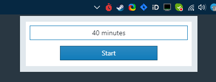
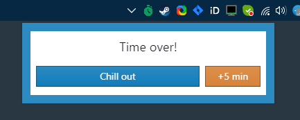

# Timer-shove

An application that sits in the tray and reminds you to take breaks from work.

# Usage

Set time interval for work and press `Start`

Check the current state of the timer

When the time is up, you will see a notification. You can take a break or add time to work

After a break, press the `Resume` button to continue working and the cycle will repeat

